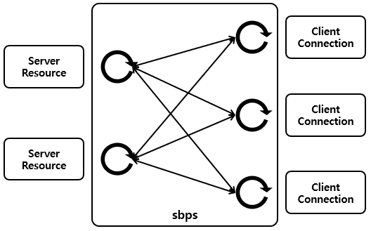

# sbps

 

sbps (Simple Broadcast Proxy Server) is the broadcast proxy server between servers and clients.

A server resource represents a server or a resource that sbps could read from or write to. A client connection represents a connection between sbps and clients, receives data from servers and sends data to servers. sbps makes dedicated goroutines for each server resources and clients connections. Each goroutines monitors a server resource or a client connection state. If a server resource or a client connection is closed, a related goroutine stopped. Server resource goroutines and client connection goroutines communicate with each other directly. Server resource and Client connection goroutines are in N:M relationship.

## Options

#### -mode (Option TCP:port, UNIX:path) (Default TCP:6060)

Set sbps proxy server mode. sbps could run as a TCP proxy server or a UNIX proxy server.

#### -resource (Option TCP:ip:port[:RW], UDP:ip:port[:RW], UNIX:path[:RW], FIFO:path[:RW])

Set server resources. sbps support TCP, UDP, UNIX, FIFO (Named Pipe) types server resource. sbps also supports RW (Read/Write) mode options for each server resources. If a server resource is used with read mode, clients only could receive or read data from the server resource. If a server resource is used with write mode, clients only could send or write data to the server resource. Default RW mode is read/write.

#### -interval (Default 2)

Set seconds of retry interval seconds for closed server resources. If the interval is less than or equal to 0, sbps do not retry for closed server resources. And if All server resources is closed, sbps stops.

#### -logpath (Default "./sbps.log")

Set log path.

#### -loglevel (Option DEBUG, INFO, WARN, ERROR, CRIT) (Default INFO)

Set logger level.

## Usage Examples

* TCP with read/write mode
~~~
# sbps -mode TCP:5000 -resource TCP:192.168.0.200:5000:RW -interval 4
~~~

* UDP with write mode, Unix with read mode, No retry
~~~
# sbps -mode TCP:6000 -resource UDP:192.168.0.200:5000:W,UNIX:/root/sbps_res:R -interval 0
~~~

* FIFO with read mode, FIFO with write mode
~~~
# sbps -mode UNIX:/root/sbps_server -resource FIFO:/root/sbps_fifo_r:R,FIFO:/root/sbps_fifo_w:W -interval 2
~~~

* Echo & Broadcast server
~~~
# sbps -mode UNIX:/root/sbps_server -resource FIFO:/root/sbps_fifo:RW -interval 3
~~~

## Build and run

* Set Env
~~~
# export GOPATH=...
# export GOBIN=...
~~~

* Get and build
~~~
# go get github.com/ssup2/sbps/
# cd $GOPATH/src/github.com/ssup2/sbps/
# make
~~~

* Run
~~~
# cd GOBIN
# ./sbps ...
~~~

